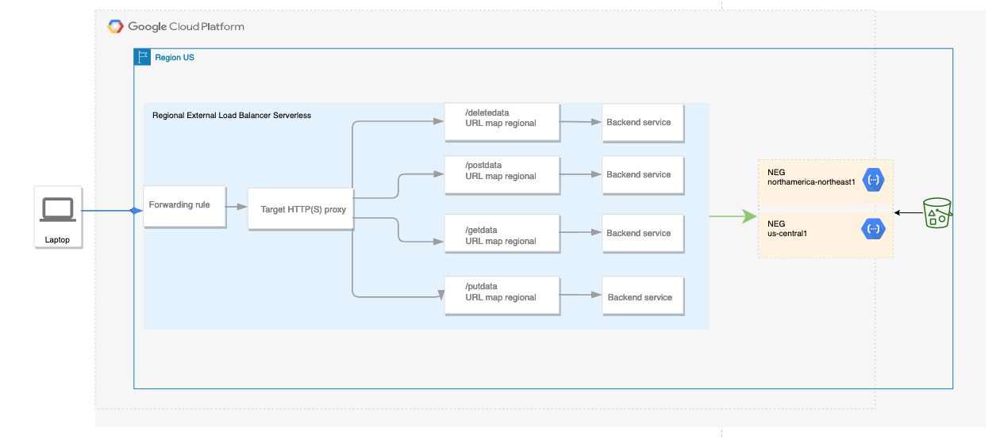

# Serverless Regional External Application Load Balancer

## Capstone Project

Deploying a regional external application load balancer with Cloud Functions. The load balancer uses a serverless NEG backend to direct requests to serverless Cloud Functions service. 
It will route traffic based on four defined paths where a backend will serve each path. Each back end will point to two network endpoints in different regions. 

**Paths:**
- deletedata
- postdata
- getdata (default path)
- putdata

**Regions:**
- northamerica-northeast1
- us-central1

### Used Technologies 
- Git repository
- Google Cloud Platform
- Terraform

**Note:** Project will be deployed and destroyed with Terraform 

### Project Definitions  

- **Terraform Organization:** dcoronado-mcit
- **Terraform Workspace:** mcti-test
- **GCP Project:** montreal-project-mcit
- **Git Name:** mcti-test

### Terraform Functions

|Function|Description|
|------|------|
|flatten |converts multi-dimensional array into one dimensional flatten array or, say single, dimensional array<sup>1</sup>|
|distinct|takes a list and returns a new list with any duplicate elements removed<sup>1</sup>|
|lower|converts all case letters in the given string to lowercase<sup>1</sup>|
|format|produces a string by formatting some other values according to a specification string<sup>1</sup>|
|split|produces a list by dividing a given string at all occurrences of a given separator<sup>1</sup>|

## How to set up a regional external Application Load Balancer with Cloud Functions

### Diagram


### Description
A regional external Application Load Balancer is a region's proxy-based Layer 7 load balancer.  
It runs and scales Serverless services behind a single external IP address. 
This external Application Load Balancer distributes **HTTP** traffic to a serverless network endpoint. 
The serverless network endpoint group (NEG) specifies a group of backend endpoints for the load balancer pointing to a Cloud Functions service.
The Cloud Function code is saved in a bucket service.

**Notes:** 
- HTTPS is not implemented
- The serverless NEG and the load balancer must be in the same region as the Cloud Functions service. 

### Features 
Load balancing is essential for applications that need high availability, reliability, and scalability. 
A Load Balancer could route traffic to the closest user location for serverless computing services such as cloud Functions, improving experience and latency for the end user. 

### IAM (Service Account)
**Name:** mcti-tutorial

**Roles:**
- Cloud Functions Admin
- Compute Instance Admin (v1)
- Compute Network Admin
- Security Admin
- Storage Admin


### Resources

| # | Resource  |  Description |
|---|---------- |  ------------------ | 
|`1`| google_compute_region_network_endpoint_group| Create a region network endpoint group |
|`2`| google_compute_backend_service| Define a group of virtual machines that will serve traffic for load balancing|
|`3`| google_compute_url_map | Route requests to a backend service based on rules defined for path|
|`4`| google_compute_target_http_proxy| Route incoming HTTP requests to a URL map|
|`5`| google_compute_global_forwarding_rule| Forward traffic to the load balancer for HTTP load balancing|
|`6`| google_cloudfunctions_function| Creates a Cloud Function resource|
|`7`| google_cloudfunctions_function_iam_member| IAM entry for all users to invoke the function |
|`8`| google_storage_bucket| Creates a new bucket in Google cloud storage service  |
|`9`| google_storage_bucket_object| Creates a new object inside an existing bucket|

#### Resource Reference

##### `google_compute_region_network_endpoint_group`

|Name| Depend On|
|----|----|
|my_function_neg|my_function|

|Arguments | Value | type |
|---------|--------|--------|
|name|neg-northamerica-northeast1, neg-us-central1|required|
|region|northamerica-northeast1,us-central1|required|
|network_endpoint_type|SERVERLESS|optional|

|Block|Name|
|-----|----|
|cloud_function|my-function-northamerica-northeast1, my-function-us-central1|


##### `google_compute_backend_service`

|Name| Depend On|
|----|----|
|my_backends_serverless|my_function_neg|

|Arguments | Value | type |
|---------|--------|--------|
|name|backend-deletedata, backend-getdata, backend-putdata, backend-postdata|required|
|load_balancing_scheme|EXTERNAL_MANAGED|optional|
|locality_lb_policy|ROUND_ROBIN|optional|
|port_name|http|optional|
|protocol|HTTP|optional|
|session_affinity|NONE|optional|
|timeout_sec|0|optional|

**Note:** Backend services that contain serverless NEG backends cannot be configured with health checks. 

|Block|Group|
|-----|----|
|backend|my_function_neg: northamerica-northeast1, us-central1 (self_link)|


##### `google_compute_url_map`

|Name| Depend On|
|----|----|
|my_url_map_serverless|my_backends_serverless|

|Arguments | Value | type |
|---------|--------|--------|
|default_service|getData (self_link)|required|
|name|path-matcher|required|
|host_rule||

|Block| Argument | Value|
|-----|----|-----|
|path_matcher|default_service|my_backends_serverless: getData (self_link)|
||path_rule|my_bakends_serverless: getdata, postdata, putdata, deletedata|
|host_rule|hosts|montreal_college|

##### `google_compute_target_http_proxy`

|Name| Depend On|
|----|----|
|my_function_neg|my_url_map_serverless|

|Arguments | Value | type |
|---------|--------|--------|
|name|my-http-proxy-serverless|required|
|url_map|my_url_map_serverless (self_link) |required|


##### `google_compute_global_forwarding_rule`

|Name| Depend On|
|----|----|
|my_serverless_load_balancer|my_http_proxy_keep_alive|

|Arguments | Value | type |
|---------|--------|--------|
|name|my_frontend|required|
|target|my_http_proxy_keep_alive (self link)|required|
|ip_protocol|TCP|optional|
|ip_version|IPV4|optional|
|load_balancing_scheme|EXTERNAL_MANAGED|optional|
|port_range|80|optional|


### Cloud Functions Files

index.js
```
const functions = require('@google-cloud/functions-framework');

functions.http('helloHttp', (req, res) => {
  res.send(`Hello ${req.query.name || req.body.name || 'World'}!`);
});
```

package.json

```
{
  "dependencies": {
    "@google-cloud/functions-framework": "^3.0.0"
  }
}
```

##### `google_cloudfunctions_function`

|Name| Depend On|
|----|----|
|my_function|my_bucket, my_archive|

|Arguments | Value | type |
|---------|--------|--------|
|name|my-function-northamerica-northeast1, my-function-us-central1|required|
|runtime|nodejs20|required|
|available_memory_mb|128|optional|
|source_archive_bucket|my_bucket: name|optional|
|source_archive_object|my_archive: name|optional|
|trigger_http|true|optional|
|entry_point|helloHttp|optional|
|region|northamerica-northeast1,us-central1|optional|

##### `google_cloudfunctions_function_iam_member`

|Arguments | Value | type |
|---------|--------|--------|
|cloud_function|my-function-northamerica-northeast1, my-function-us-central1: Name|required|
|role|cloudfunctions.invoker| required|
|member|allUsers|required|


##### `google_storage_bucket`

|Arguments | Value | type |
|---------|--------|--------|
|name|my-function-northamerica-northeast1, my-function-us-central1: Name|required|
|location|cloudfunctions.invoker| required|


##### `google_storage_bucket_object` 

|Name| Depend On|
|----|----|
|my_archive|my_bucket|

|Arguments | Value | type |
|---------|--------|--------|
|name|code.zip|required|
|bucket|my_bucket: name| required|
|source|code.zip|optional|

## References

|URL|
|-----|
||
||
||
|<sup>1</sup> |
||


